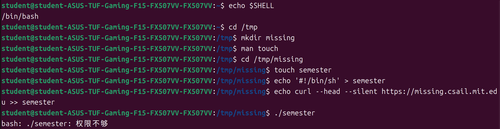

# 视作组作业——王佳靖
 学长你好！我是来自自动化与智能学院信号2302班的王佳靖，假期考核作业均已完成，下面是我对作业的展示和解释

## P2作业
### task1
下图是对题目1-8的解答
说明：
1.使用echo命令来查看程序是否正确。
2.使用cd命令移动到tmp文件夹。
3.使用mkdir命令创建名为missing的文件夹。
4.使用touch创建semester文件。
5.使用">"标志符向semester文件中写入文本。
6.使用">>"标志符向semester文件中追加写入文本。
7../semeter运行文件失败，是由于权限不够导致的。

下图是第5题的效果，可见相应的文本已经被写入到了semester文件中。

8.使用sh命令，可以成功运行文件（not found应该是网址问题，实际上文件已经执行）
为什么使用sh命令可以运行而./命令无法运行？
我认为这是由于semester文件的第一行指定了sh解释器，所以这个文件就只能用sh命令来运行。

9.使用chmod命令赋予权限后，./指令就可以运行该文件了。

下图是对题目9-11的解答

### task4
下图是使用opencv库通过cmake编译展示了一张碧蓝档案logo的图片，源代码已在图中展示。

## P3作业
下面三张图片展示了运行效果和两个结点的源代码

首先我通过使用“鱼香ros”安装了ros1运行环境，然后创建了catkin_ws作为工作空间，接下来在新建立的learn_topic包里创建了名为Person.msg文件，准备自定义消息类型，消息类型为三个uint64变量。紧接着我分别在package.xml文件中加入了自定义消息类型所需要的包，在CMakeLists.txt文件中添加相应的包（generation和runtime）。在使用CMake完成编译后，在src文件夹中新建两个CPP文件作为订阅者和发布者，在发布者结点中使用advertise函数发布了消息类型为“Person”的名为“learn_topic”的话题，内容为三个123数字，在订阅者结点中使用subscribe函数订阅了相应的话题，通过Callback函数把消息类型打印在屏幕上。由此，两个结点间的话题通信已经完成，运行效果如图，通过查看关系结点图可以发现两个结点之间通过话题“learn_topic”进行通信。
*另附视频，视频中展示了源代码和运行流程*

## P4作业
下图是模型训练过程中和训练完成的截图

首先我在miniconda官网安装了miniconda，然后打开Anaconda Prompt终端，在里面输入指令安装ultralytics Python3.9版本，然后在清华镜像网站上安装了pypi，然后在官网安装了pytorch，最后在vscode中完成环境配置。
在完成环境配置后，我参考了test文件中的data.yaml中的标注顺序，在make sence网站中对100多个图片进行了标注，标注完成后我把生成的txt文件导入到了labels文件夹中。然后打开vscode，在编译器中创建了yolo-bvn.yaml对训练进行配置，配置完成后在终端中输入相应命令对模型进行训练，训练完成后得到.pt文件。训练模型和pt.文件存放在detect文件夹中。